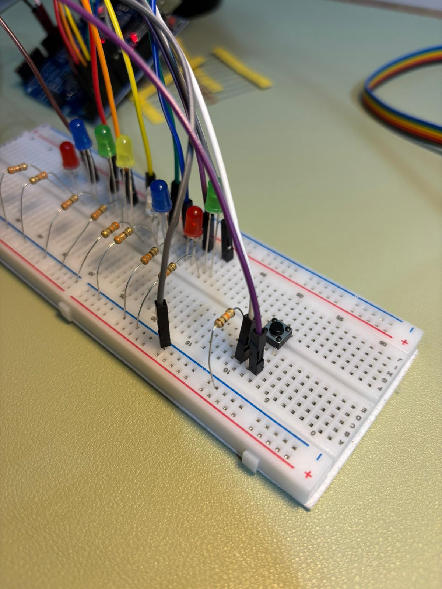

# Knight Rider LED Chaser

This project demonstrates a sequential LED animation using an Arduino Uno. The code is written in C++ using arrays and features non-blocking logic for a responsive user experience.

## Components

* Arduino Uno
* 8x LEDs
* 8x 330Ω Resistors
* 1x Push Button & 10kΩ Resistor
* Jumper Wires & Breadboard

## How to Use

1. Connect the LEDs to digital pins 2 through 9 and the button to pin 10.
2. Open `ButtonToggleChaser.ino` in Arduino IDE.
3. Upload the code to your board.
